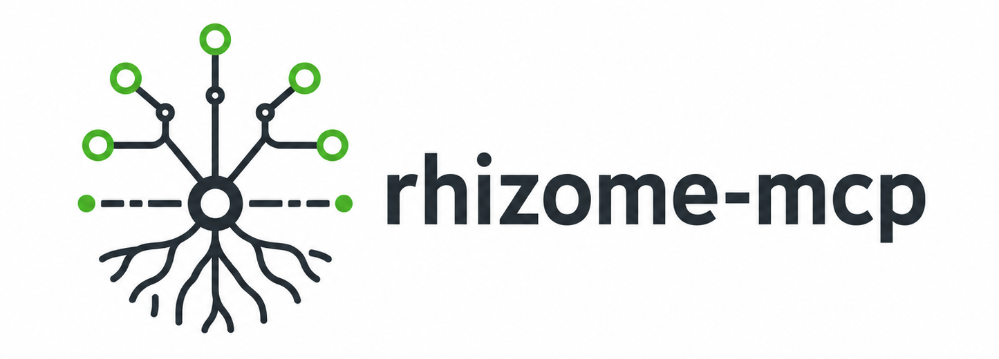

<p align="center">
  
</p>

<p align="center">
  <a href="https://github.com/Odrin/rhizome-mcp/actions/workflows/ci.yml"></a>
  <a href="https://github.com/Odrin/rhizome-mcp/actions/workflows/ci.yml"></a>
  <a href="https://github.com/Odrin/rhizome-mcp/actions/workflows/ci.yml"></a>
  <a href="https://github.com/Odrin/rhizome-mcp/releases"></a>
  <a href="go.mod"></a>
  <a href="LICENSE"></a>
  <a href="https://www.npmjs.com/package/rhizome-mcp"></a>
</p>

**rhizome-mcp** is a local-first MCP server for task tracking and coordination of autonomous AI coding agents. It gives agents from different products — Claude Code, Codex, GitHub Copilot, VS Code, and any other MCP-compatible client — a shared, durable view of project work: one static Go binary, one SQLite database per project, no accounts, no Docker, no network dependency.

## Why

AI coding agents are concurrent, context-limited, and interruptible. A `TODO.md` or a single chat context doesn't survive that. rhizome-mcp is built around those failure modes:

- **Crash-safe claiming.** Issues are claimed atomically with renewable leases. `in_progress` is never a stored status — it is derived from an active lease, so a vanished agent can't lock an issue forever. When the lease expires, the issue becomes claimable again. A partial unique index guarantees at most one active attempt per issue at the database level.
- **Durable project memory.** Checkpoints with next steps, supersedable decision records, append-only event history, and FTS5 full-text search across issues, comments, decisions, and notes. A fresh session resumes from the last checkpoint instead of re-deriving state.
- **Token-efficient by contract.** Compact list projections (a 100-issue page stays under 64 KB — enforced by an integration test), graph nodes that exclude free-text bodies at the SQL layer, snippet-only search, delta sync via event IDs, and a bounded single-call work-context package.
- **Planning and dependency graphs.** Cycle-checked `blocks` relations, epics, claimable entry-point highlighting, and atomic batch planning (up to 50 issues, 100 relations, and 20 decisions in one all-or-nothing transaction).
- **Review workflow.** Review requests pin an exact issue version and event position; stale targets are superseded automatically, so approving changed code is impossible.
- **Concurrency discipline throughout.** Optimistic versioning on mutations, replay-safe idempotency keys, stable machine-actionable error codes.
- **Human observability without a server.** `rhizome-mcp board` prints live leases, blockers, and the review queue, or writes a self-contained HTML snapshot; the CLI reads everything as tables, JSON, or Mermaid.

**Use it when** several agent sessions (or several agent products) work the same repository over time and you need handoffs, parallel work, and recovery after crashes or context limits.

**Skip it if** you need a hosted multi-user tracker with auth, permissions, and a web UI — this is a local single-developer tool by design.

## Quick start

### Install and run

Choose the approach that matches your workflow:

#### Zero-install trial via npm

Try `rhizome-mcp` immediately with no separate binary install, no Go toolchain:

```bash
npx rhizome-mcp serve
```

Works with any MCP client. See [packages/npm/README.md](packages/npm/README.md) for platform coverage. Great for quick evaluation.

#### VS Code

Install [Rhizome MCP](https://marketplace.visualstudio.com/items?itemName=odrin.rhizome-mcp) (`odrin.rhizome-mcp`) from the Marketplace or [Open VSX](https://open-vsx.org/extension/odrin/rhizome-mcp). The extension bundles the platform binary, registers the MCP server automatically, and adds `Rhizome: Initialize Project` to the Command Palette. No terminal, no `mcp.json` editing. Details: [docs/10-vscode-extension.md](docs/10-vscode-extension.md).

Prefer a standalone binary with a plain `mcp.json` entry instead? Install the binary below and use this one-click link: [Add to VS Code](vscode:mcp/install?%7B%22name%22%3A%22rhizome-mcp%22%2C%22type%22%3A%22stdio%22%2C%22command%22%3A%22rhizome-mcp%22%2C%22args%22%3A%5B%22serve%22%5D%7D).

#### Native binary installer

Download and install a release binary for your platform. Verifies checksums, installs to `~/.local/bin` by default:

```bash
curl -fsSL https://raw.githubusercontent.com/Odrin/rhizome-mcp/main/scripts/install.sh | sh
```

```powershell
irm https://raw.githubusercontent.com/Odrin/rhizome-mcp/main/scripts/install.ps1 | iex
```

#### Official MCP Registry

Use `rhizome-mcp` via the official MCP Registry, available in the [Model Context Protocol registry](https://registry.modelcontextprotocol.io) as `io.github.Odrin/rhizome-mcp` for clients that consume the registry.

### Initialize and connect

Initialize tracking inside your repository:

```bash
rhizome-mcp init
```

Then register the server with your MCP client. Automated setup for common clients:

```bash
rhizome-mcp connect claude    # Claude Code
rhizome-mcp connect codex     # Codex
rhizome-mcp connect vscode    # VS Code (if using standalone binary instead of extension)
rhizome-mcp connect json      # Template for any other client
```

Use `--print` for a dry run. `connect` discovers your project's actual root
(walking up from the current directory the same way `serve` does) and pins
it with `--project-root`, so the written config works regardless of which
subdirectory an MCP client later launches the server from. All four targets
(`claude`, `codex`, `vscode`, `json`) agree on this. The manual equivalent
for any MCP client, matching `connect`'s own server key:

```json
{
  "mcpServers": {
    "rhizome-mcp": {
      "command": "/absolute/path/to/rhizome-mcp",
      "args": ["serve", "--project-root", "/absolute/path/to/your/repository"]
    }
  }
}
```

or, via `npx`, without installing a binary at all:

```json
{
  "mcpServers": {
    "rhizome-mcp": {
      "command": "npx",
      "args": ["-y", "rhizome-mcp", "serve", "--project-root", "/absolute/path/to/your/repository"]
    }
  }
}
```

`connect` detects when it is itself running through the `npx rhizome-mcp`
wrapper and automatically emits this `npx` form instead of the wrapper's
resolved binary path, which lives in the npx cache and goes stale on
eviction or a version bump. A config written with a resolved absolute path
(the default otherwise) is machine-specific and not meant to be checked in
and shared across machines; pass `connect TARGET --command` to instead emit
a bare `rhizome-mcp` command name that relies on `PATH`, for a portable
config you do intend to share, provided every machine that uses it has
`rhizome-mcp` on `PATH`.

Stdio is the default transport; protocol output goes to stdout, logs to
stderr.

That's it — connected agents start with `open_project` using the absolute repository root, retain its `project_ref`, and pass that reference to later project-scoped calls. See [the agent workflow guide](.github/skills/rhizome-task-workflow/references/agent-workflow.md) for the complete workflow. The returned metadata links the `rhizome://guides/agent-workflow`, `rhizome://guides/issue-lifecycle`, and `rhizome://guides/multi-agent-handoff` resources, and repository agents can load the `rhizome-task-workflow` skill from `.github/skills/`.

#### Install the agent workflow skill

For agents that support the open [Agent Skills](https://agentskills.io/) format, install `rhizome-task-workflow` with the npm-distributed [`skills`](https://skills.sh/) CLI:

```bash
npx skills add Odrin/rhizome-mcp --skill rhizome-task-workflow
```

Run the command in a project for a project-scoped installation, or add `--global` to make the skill available across projects. The skill teaches compatible agents how to select, claim, checkpoint, hand off, and finish Rhizome work. It complements the MCP server; it does not install the `rhizome-mcp` binary or configure an MCP connection.

### Monitor your project

```bash
rhizome-mcp board                        # status counts, active leases, blockers, review queue
rhizome-mcp board --serve                # interactive local board UI at a loopback URL
rhizome-mcp board --output board.html    # self-contained HTML snapshot with the planning graph
rhizome-mcp issue list --status ready
rhizome-mcp graph ISSUE-42 --format mermaid
rhizome-mcp doctor --full
```

The status board reports live lease counts, blocked issues and their reasons, open review requests, and the project-wide planning graph. The planning graph excludes finished work (done, cancelled) from the node budget, so the entry-point count always reflects claimable work. When the graph is truncated due to the 100-node budget, the board marks it as truncated and reports the retained node count in both table and JSON formats.

### Optional: local HTTP transport

```bash
rhizome-mcp serve --http-address 127.0.0.1:0
```

The bound endpoint is logged to stderr; the Streamable HTTP endpoint is `http://127.0.0.1:<port>/mcp`. The transport is loopback-only, unauthenticated, and enforces strict Host/Origin validation plus a 1 MiB outer request body limit. Modern MCP `2026-07-28` clients call `server/discover` and then send direct requests with protocol metadata; legacy `2025-11-25` clients can still use `initialize` and `notifications/initialized` without relying on a persistent transport session. If you want durable audit attribution, create an explicit `agent_session_handle` with `create_agent_session`, pass it to the relevant mutating tools, and end it later with `end_agent_session`; transport closure never ends it.

## How it works

`init` writes exactly one file into the repository:

```json
{
  "version": 1,
  "project_id": "01J..."
}
```

stored as `.agent-tracker.json`. The SQLite database lives outside the repository in the platform application-data directory, resolved through `project_id`:

```text
<application-data>/rhizome-mcp/projects/<project-id>/tasks.db
```

Use `--data-root PATH` to select an explicit data root for any command. Nothing else touches your repository, and the database is never committed to Git.

**Design principle:** an issue must never remain permanently stuck in `in_progress`. Effective status is computed from stored status plus the presence of an active leased attempt; if the agent disappears and the lease expires, the attempt becomes `expired` and the issue is available again when its stored state permits it.

**Core constraints (by design):** Go, SQLite (`modernc.org/sqlite`, pure Go, CGO-free), stdio as the primary transport, one database per project, no hosted or authenticated web UI (a loopback-only local status board is included), no authentication, minimal CLI. Deferred features are listed in [docs/06](docs/06-deferred-and-open.md).

## CLI reference

| Command | Purpose |
| --- | --- |
| `init` | Create `.agent-tracker.json` and the project database |
| `serve [--http-address ADDR] [--profile full\|agent\|read-only\|migration] [--toolsets GROUP[,GROUP...]] [--project-root PATH]` | Run the MCP server (stdio; `--http-address` for local HTTP; `--profile` to narrow the advertised tool catalog to a named profile, or `--toolsets` to compose one from capability groups; `--project-root` to serve a project other than the working directory) |
| `connect TARGET [--print] [--command]` | Register the server with an MCP client (`claude`, `codex`, `vscode`, `json`) |
| `board [--output PATH] [--serve [--http-address ADDR]]` | Status board: counts, leases, blockers, review queue; optional HTML snapshot; `--serve` runs a temporary HTTP server |
| `issue list` / `issue show ISSUE-ID` | Inspect issues with filters |
| `search QUERY` | Full-text search across issues, comments, decisions, notes |
| `graph ISSUE-ID` | Dependency graph as table, JSON, or Mermaid |
| `project info` / `project export` / `project import` | Project metadata; logical JSON export; logical JSON import (`--input PATH|-` with `--dry-run` or `--apply`) |
| `backup --output PATH` | WAL-safe online backup |
| `doctor [--full]` | Integrity, schema, and invariant checks |
| `maintenance release-attempt` / `rebuild-search-index` | Administrative recovery |

Run `rhizome-mcp` without arguments for complete usage, `rhizome-mcp version` for build information.

## MCP surface

The server exposes 43 tools covering the full lifecycle: project discovery, issue CRUD with labels and relations, planning and dependency graphs, batch plan validation/apply, comments and decisions, claim/renew/checkpoint/finish work attempts with optional atomic resource reservations, work-context assembly, review requests, full-text search, delta changes, logical project export/import, and workflow-policy administration with gate evidence and diagnostics. The complete contract, including the MCP tool annotation matrix and the `full`/`agent`/`read-only`/`migration` exposure profile matrix, is in [docs/03-mcp-tools.md](docs/03-mcp-tools.md).

By default `serve` advertises the complete `full` catalog. Pass `--profile agent|read-only|migration` (or set `RHIZOME_TOOL_PROFILE`) to narrow it — for example `serve --profile read-only` for a client that should never see a mutating tool. When no named profile fits, pass `--toolsets` (or set `RHIZOME_TOOLSETS`) with a comma-separated list of capability groups instead — for example `serve --toolsets issues,planning` — to advertise exactly those groups plus the always-on `core` pair (`open_project`, `get_project`); the two flags are mutually exclusive. Profiles and toolsets are an exposure and prompt-size control, not an authorization boundary: every tool still enforces its own server-side validation regardless of what a client can see in `tools/list`. See [docs/04-storage-runtime.md](docs/04-storage-runtime.md) §17.1 for the full environment-variable set and precedence, including the deprecated unprefixed fallback names.

## Documentation

The modular files under `docs/` are the canonical specification; [SPEC.md](SPEC.md) is the index. Agents should load only the sections relevant to their current task ([AGENT_BRIEF.md](AGENT_BRIEF.md) explains how).

1. [Product goals and scope](docs/01-product-scope.md)
2. [Domain model](docs/02-domain-model.md)
3. [MCP tools](docs/03-mcp-tools.md)
4. [Storage and runtime](docs/04-storage-runtime.md)
5. [Implementation requirements](docs/05-implementation-requirements.md)
6. [Deferred features and non-goals](docs/06-deferred-and-open.md)
7. [Logical interchange format](docs/07-logical-interchange.md)
8. [Local HTTP transport contract](docs/08-local-http-transport.md)
9. [Review workflow contract](docs/09-review-workflow.md)
10. [VS Code extension](docs/10-vscode-extension.md)
11. [Project routing contract](docs/11-project-routing.md)
12. [Resource reservations](docs/12-resource-reservations.md)
13. [Status board](docs/13-status-board.md)

Guides for humans (quick start, workflow, CLI) live in [site/](site/) and are published via GitHub Pages. Release history is in the [CHANGELOG](CHANGELOG.md).

## Development

Build and test (no CGO, no external services):

```bash
CGO_ENABLED=0 go build -o rhizome-mcp .
go test ./...
go test -tags=integration ./...
```

The integration tag runs real-process MCP smoke and workflow tests: they build a temporary server binary, initialize a fresh repository and SQLite data root per test, and speak to `serve` over stdio or HTTP. Beyond single-process smoke coverage, the suite also exercises cross-process scenarios on one shared SQLite data root — concurrent claim and update-version races, an ungraceful process kill and restart, and a backup taken while a server is writing — to catch defects a single-process test structurally cannot see. Most live in the dedicated `integration` package; tests that need unexported package-main internals stay at the repository root.

CI runs `go vet`, unit, and integration tests on Ubuntu, macOS, and Windows for every push and pull request targeting `main`. Releases (`.github/workflows/release.yml`) publish CGO-free binaries with SHA-256 checksums for linux/amd64, linux/arm64, darwin/amd64, darwin/arm64, and windows/amd64; release binaries embed the version, commit, and build timestamp (local builds report git VCS info or `dev`, and the `VERSION` environment variable overrides both).

Release verification includes:
- Full `go test ./...` suite runs before binary upload
- Built binaries are smoke-tested (e.g., `./rhizome-mcp --version` verifies version string matches tag)
- npm launcher test suite runs before npm publish (catches regressions in the Node.js launcher wrapper)
- VS Code extension binaries are checked out from the tagged source (not `main`) on workflow_dispatch re-publish, ensuring version lockstep
- Aggregate release-status job fails the workflow if any publish step (npm, MCP Registry, Marketplace, Open VSX) fails, making partial failures visible

This repository tracks its own backlog in rhizome-mcp: work is selected, claimed, and finished through the MCP server, and durable choices are recorded as decisions. Markdown holds specification only, not task status. See [AGENTS.md](AGENTS.md) and [CONTRIBUTING.md](CONTRIBUTING.md).

## License

[Apache-2.0](LICENSE). Security policy: [SECURITY.md](SECURITY.md).
