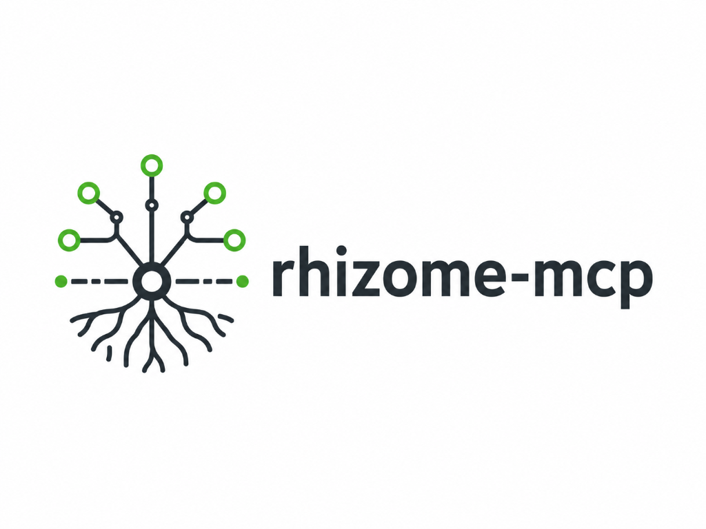

# rhizome-mcp

rhizome-mcp is a local-first MCP server for task tracking and coordination. It gives agents and human collaborators a shared project memory that works from a normal repository checkout and a local SQLite database, without requiring a web UI or a hosted service.

## Why teams and agents adopt it

- Agents can create, refine, link, and search issues without relying on a single chat thread.
- The workflow keeps durable decisions, checkpoints, and review notes alongside the project state.
- Claiming is atomic and lease-based, so interrupted sessions can recover cleanly.
- The CLI and MCP server share the same local-first runtime, which keeps operations predictable and easy to verify.

## What the runtime looks like

- One project uses one SQLite database stored outside the repository.
- The repository keeps only `.agent-tracker.json`.
- MCP transport is stdio; the CLI is for initialization, inspection, backup, and maintenance.
- The project is intentionally simple: a native binary, local execution, and no web UI in the first version.

## Start here

- [Quick start](./quick-start.md) to install, initialize, and connect clients.
- [Workflow guide](./workflow.md) for safe claim, checkpoint, and finish cycles.
- [CLI reference](./cli.md) for every supported command and flag.
- [Product scope](https://github.com/Odrin/rhizome-mcp/blob/main/docs/01-product-scope.md) and [MCP tools](https://github.com/Odrin/rhizome-mcp/blob/main/docs/03-mcp-tools.md) for the canonical specification.

This site documents the local CLI and MCP integration. It is not the deferred product web UI.
