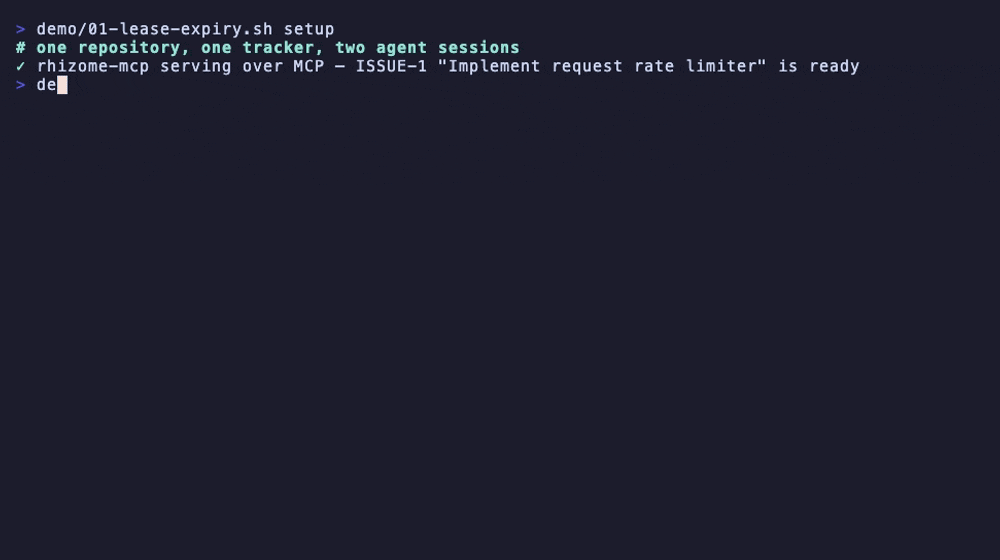

# rhizome-mcp

**When a coding agent dies mid-task, the task frees itself.**

rhizome-mcp gives autonomous coding agents crash-safe task coordination over MCP: claims are renewable expiring leases, `in_progress` is derived — never stored — and an interrupted attempt hands its checkpoint to whichever session picks the work up next. One static Go binary, one SQLite database per project. No daemon, no accounts, no cloud.

## Why teams and agents adopt it

- Agents can create, refine, link, and search issues without relying on a single chat thread.
- The workflow keeps durable decisions, checkpoints, and review notes alongside the project state.
- Claiming is atomic and lease-based, so interrupted sessions can recover cleanly.
- The CLI and MCP server share the same local-first runtime, which keeps operations predictable and easy to verify.

## What the runtime looks like

- One project uses one SQLite database stored outside the repository.
- The repository keeps only `.agent-tracker.json`.
- MCP transport is stdio; the CLI is for initialization, inspection, backup, and maintenance.
- The project is intentionally simple: a native binary, local execution, and no web UI in the first version.

## Start here

- [Quick start](./quick-start.md) to install, initialize, and connect clients.
- [How rhizome-mcp compares](./compare.md) with beads, Kata, Guild, and Backlog.md — on guarantees, with sources.
- [Rhizome MCP on the VS Code Marketplace](https://marketplace.visualstudio.com/items?itemName=odrin.rhizome-mcp) for the zero-config VS Code install (bundles the binary, registers the server automatically).
- [Workflow guide](./workflow.md) for safe claim, checkpoint, and finish cycles, including review request, discover, claim, complete, follow-up, and re-request guidance.
- [CLI reference](./cli.md) for every supported command and flag.
- [Product scope](https://github.com/Odrin/rhizome-mcp/blob/main/docs/01-product-scope.md) and [MCP tools](https://github.com/Odrin/rhizome-mcp/blob/main/docs/03-mcp-tools.md) for the canonical specification.

This site documents the local CLI and MCP integration. It is not the deferred product web UI.
